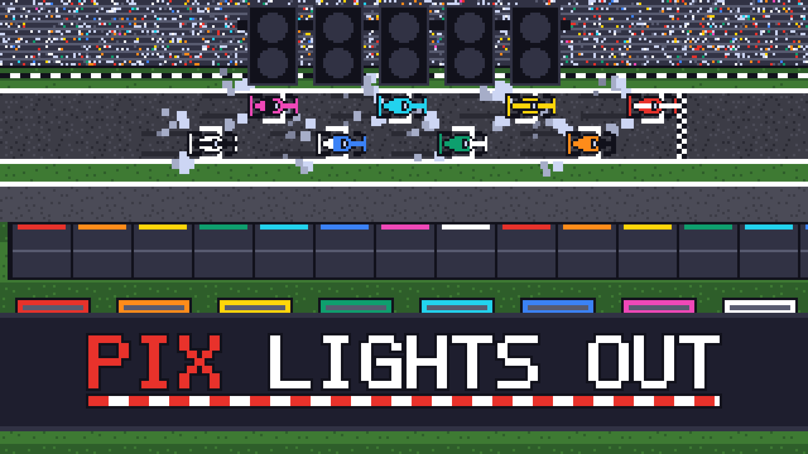

# PIX LIGHTS OUT



**ブラウザで遊べる、見下ろし型のピクセルアート・フォーミュラレース。**

5 つのランプが消えたらスタート。コーナーの手前でしっかりブレーキ、きれいなラインで曲がって、立ち上がりで踏む。1 周約 37 秒、1 レース 2〜3 分の短いレースで、CPU や友だちと競います。

## ▶ 遊ぶ

**https://kaseliaepenguin.github.io/pix-lights-out/**

インストールは不要です。パソコンのモダンブラウザ (Chrome・Edge・Firefox など) とキーボードで遊べます。

## モード

| モード | 内容 |
| --- | --- |
| **TIME ATTACK** | 1 人でコースを周回し、ラップタイムを縮める。自己ベストの周はゴーストとして記録され、次の走行で一緒に走る |
| **SINGLE RACE** | CPU 車 (1〜7 台) と 3 周のレース。難易度は EASY / NORMAL / HARD。最後尾からのスタート |
| **MULTIPLAYER** | 最大 8 人のオンライン対戦。招待リンクを送るだけで、ブラウザ同士が直接つながる (サーバー不要) |

## 操作

| 操作 | キー |
| --- | --- |
| アクセル | `Z` |
| ブレーキ / 後退 (止まってから押し続ける) | `X` |
| ハンドル | `←` `→` |
| DRS (DRS 区間で使える) | `Space` |
| コース復帰 (`PRESS R TO RESET` が出ているとき) | `R` |
| ポーズ | `Esc` |
| メニュー | `↑` `↓` で選択、`Enter` で決定、`Esc` で戻る |

ハンドルは車から見た左右です。カメラは車の向きに合わせて回るので、画面の左右と一致します (設定で北が上の固定表示にもできます)。

## レースのルール

- **スタート**: ランプが 1 つずつ点き、5 つそろってから少し待って全部消えたらスタート。消えるまで車は動きません。消えた瞬間にアクセルを踏んでいると発進できないので、一度離して踏み直します。反応の速さが表示されます
- **追い抜き**: 前の車の真後ろにつくとスリップストリームで速くなります。検知ラインで前の車との差が 1 秒以内なら、次の DRS 区間で DRS を開いて最高速を上げられます
- **接触**: ぶつけた側も減速します。強くぶつけるとスピンします
- **コース復帰**: 止まってしまった、コース外から戻れない、逆走している、などのときは `PRESS R TO RESET` が出て、`R` でコースに戻れます。戻った直後の数秒間は、ほかの車をすり抜けるゴースト状態になります
- **HUD**: 左上に順位表、右上にラップタイムと区間 S1〜S3 の結果 (箱の色で表示。自己ベストは緑、全体ベストは紫)、下中央に前後の車との差

## オンライン対戦のしかた

1. 全員が上のページを開く
2. ホスト: `MULTIPLAYER` → `CREATE LOBBY`。招待リンクが自動でコピーされるので、チャットの DM で友だちに送る
3. 友だち: 招待リンクを開く。返答コードが自動でコピーされるので、ホストに送り返す
4. ホスト: ゲームの画面で `Ctrl+V` を押して返答コードを貼る。参加者がそろったら `START RACE`

- 招待リンク 1 本につき 1 人が参加できます。2 人目以降は `NEW INVITE` で次のリンクを作ります
- 一度つながれば、レースのあとロビーに戻って何レースでも続けて遊べます
- 招待リンクと返答コードには、あなたのインターネット回線の IP アドレスが含まれます。一緒に遊ぶ信頼できる相手にだけ、個別に渡してください
- ホストはレース中にタブを閉じたり再読み込みしたりしないでください
- 中継サーバーを使わないため、回線の組み合わせによってはつながらないことがあります。そのときはホストを交代する、別の回線 (テザリングなど) を使う、同じ Wi-Fi で遊ぶ、を試してください
- 全員が同じバージョンで遊ぶ必要があります。つながらないときは、全員でページを再読み込みしてください

## 開発者向け

TypeScript + Canvas 2D で作っています。ゲームエンジンは使わず、ゲームループ・シーン管理・入力処理・車の物理を自前で実装しています。オンライン対戦は WebRTC DataChannel によるホスト・クライアント方式です。

```bash
npm install
npm run dev                  # 開発サーバー (http://localhost:5173)
npm run build                # 型チェック + 本番ビルド (dist/)
node scripts/sim-lap.mjs     # 物理・レース進行のヘッドレス確認
node scripts/sim-net.mjs     # 通信・オンライン対戦のヘッドレス確認
```

- `main` に push すると、GitHub Actions でビルドして GitHub Pages に公開します (`.github/workflows/deploy-pages.yml`)
- 仕様書は `docs/design/` (ゲームデザイン・車の物理・通信方式)、見た目と音の方針は `docs/art/`・`docs/sound/`
- 開発時は `?scene=timeattack` / `?scene=race` / `?scene=lobby-host` で各画面から直接始められます

### 素材について

画像・BGM・効果音は、ローカルで動かした画像・音声の生成 AI で作っています (SDXL + pixel-art-xl LoRA、ACE-Step、Stable Audio Open)。作り方は `docs/setup/comfyui.md` を参照してください。
